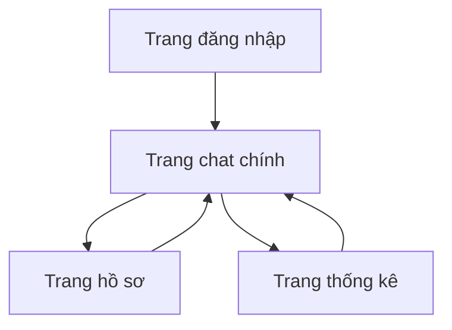

# 1. Tổng quan sản phẩm
Chatbot AI chuyên trả lời các câu hỏi về triết học Marx-Lenin với giao diện tương tự ChatGPT, thời gian phản hồi 3-5 giây. Người dùng có thể tùy chỉnh avatar và xem thống kê sử dụng.
Sản phẩm nhằm cung cấp công cụ học tập và tra cứu triết học Marx-Lenin hiệu quả cho học sinh, sinh viên và người quan tâm đến chủ nghĩa xã hội.

# 2. Tính năng cốt lõi

## 2.1 Vai trò người dùng
| Vai trò | Phương thức đăng ký | Quyền hạn cốt lõi |
| --- | --- | --- |
| Người dùng thường | Email hoặc Google OAuth | Chat với AI, tùy chỉnh avatar, xem thống kê cá nhân |
| Quản trị viên | Đăng ký qua mã mời | Quản lý người dùng, xem thống kê hệ thống, điều chỉnh cấu hình AI |

## 2.2 Mô-đun tính năng
Ứng dụng bao gồm các trang chính sau:
- **Trang chat chính**: Giao diện chat tương tự ChatGPT, hiển thị lịch sử hội thoại, nhập câu hỏi, hiển thị câu trả lời AI.
- **Trang hồ sơ người dùng**: Tùy chỉnh avatar, thông tin cá nhân, cài đặt tài khoản.
- **Trang thống kê**: Hiển thị số lượng câu hỏi, thời gian sử dụng, chủ đề thường hỏi.
- **Trang đăng nhập/đăng ký**: Form đăng nhập và đăng ký tài khoản mới.

## 2.3 Chi tiết trang
| Tên trang | Mô-đun | Mô tả tính năng |
| --- | --- | --- |
| Trang chat chính | Khu vực chat | Hiển thị tin nhắn theo dạng conversation, cuộn tự động khi có tin nhắn mới |
| Trang chat chính | Thanh nhập liệu | Ô nhập câu hỏi, nút gửi, hiển thị trạng thái đang gõ và đang xử lý |
| Trang chat chính | Sidebar lịch sử | Liệt kê các cuộc hội thoại trước đó, cho phép tạo chat mới, xóa lịch sử |
| Trang hồ sơ | Avatar | Upload ảnh đại diện, cắt ảnh theo tỷ lệ 1:1, lưu vào cloud storage |
| Trang hồ sơ | Thông tin cá nhân | Hiển thị và chỉnh sửa tên, email, ngày tham gia |
| Trang thống kê | Tổng quan | Hiển thị tổng số câu hỏi, thời gian sử dụng, ngày hoạt động gần nhất |
| Trang thống kê | Biểu đồ | Biểu đồ cột thể hiện số câu hỏi theo tuần, biểu đồ tròn chủ đề thường hỏi |
| Đăng nhập/Đăng ký | Form đăng nhập | Nhập email/password, nút đăng nhập, liên kết quên mật khẩu |
| Đăng nhập/Đăng ký | Form đăng ký | Nhập email, password, xác nhận password, đồng ý điều khoản |

# 3. Luồng hoạt động chính
Luồng người dùng thường:
1. Truy cập trang web → Đăng nhập/Đăng ký tài khoản
2. Vào trang chat chính → Nhập câu hỏi về triết học Marx-Lenin
3. AI xử lý và trả lời trong 3-5 giây → Hiển thị câu trả lời
4. Có thể tiếp tục hỏi trong cùng cuộc hội thoại hoặc tạo cuộc hội thoại mới
5. Truy cập trang hồ sơ để tùy chỉnh avatar
6. Xem thống kê sử dụng trong trang thống kê

# 4. Thiết kế giao diện người dùng

## 4.1 Phong cách thiết kế
- **Màu sắc chính**: Đỏ tươi (#DC2626) - tượng trưng cho chủ nghĩa xã hội
- **Màu sắc phụ**: Xám đậm (#374151) và trắng (#FFFFFF)
- **Kiểu nút**: Bo tròn 8px, shadow nhẹ khi hover
- **Font chữ**: Inter, kích thước 14px cho nội dung, 16px cho tiêu đề
- **Layout**: Chat-based với sidebar bên trái, responsive
- **Biểu tượng**: Sử dụng Heroicons, minimalist style

## 4.2 Tổng quan thiết kế trang
| Tên trang | Mô-đun | Thành phần UI |
| --- | --- | --- |
| Trang chat | Sidebar | Nền xám nhạt, chiều rộng 280px, chứa logo và danh sách chat |
| Trang chat | Khu vực chat | Nền trắng, tin nhắn user có nền xám nhạt, tin nhắn AI có nền đỏ nhạt |
| Trang chat | Thanh nhập | Nằm dưới cùng, chiều cao 60px, có viền đỏ mỏng |
| Trang hồ sơ | Avatar | Hình tròn 120px, border 3px đỏ, hiển thị preview ngay lập tức |
| Trang thống kê | Biểu đồ | Sử dụng Chart.js, màu đỏ gradient, có animation khi load |

## 4.3 Responsive
Thiết kế desktop-first, responsive cho tablet (768px) và mobile (375px). Trên mobile, sidebar ẩn vào menu hamburger, chat chiếm toàn bộ chiều rộng.

## 4.4 Hiệu suất và trải nghiệm
- Loading skeleton khi chờ phản hồi AI
- Lazy load cho hình ảnh và biểu đồ
- Debounce 300ms cho ô nhập liệu
- Cache phản hồi AI cho câu hỏi tương tự
