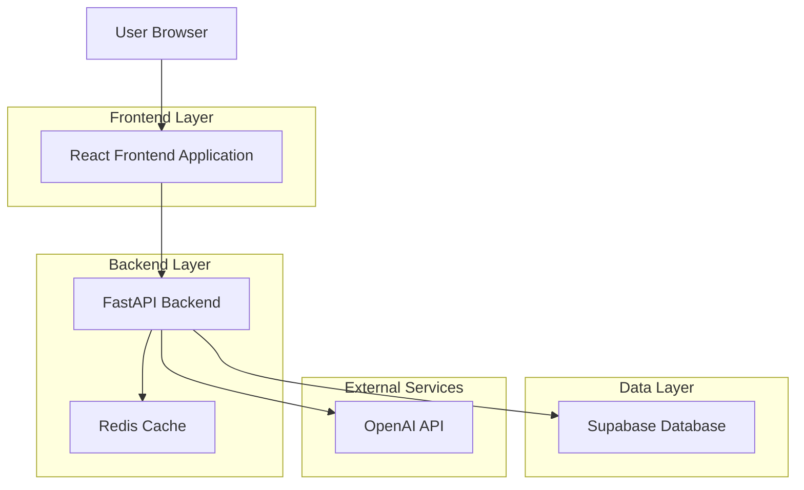
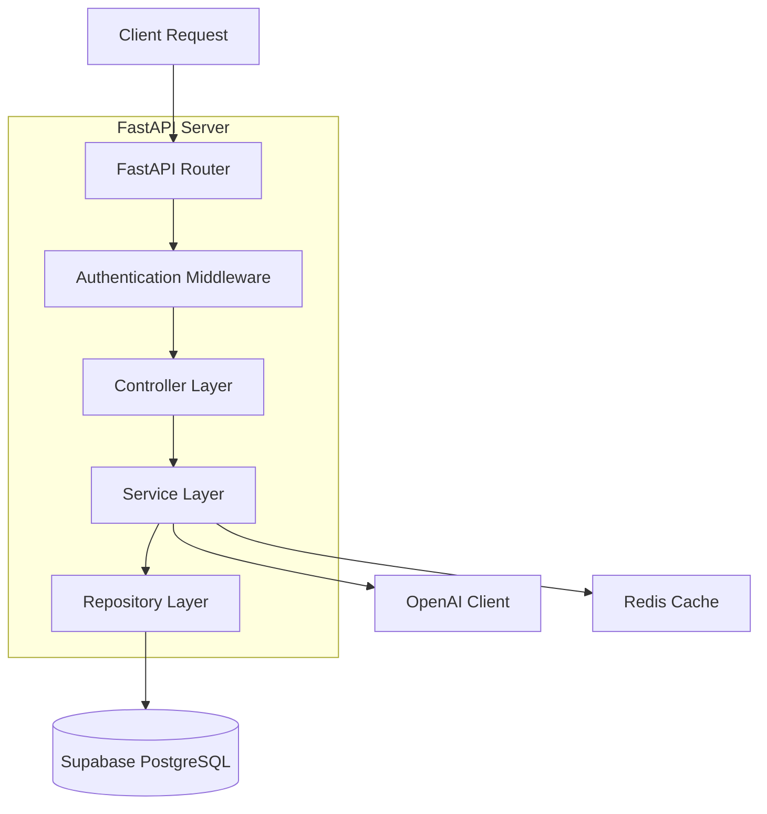
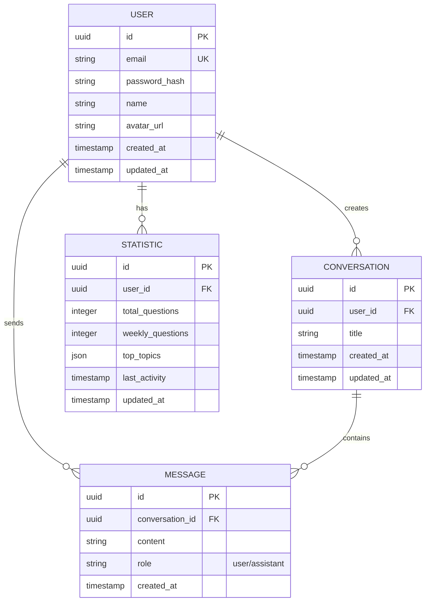

# 1. Thiết kế kiến trúc



# 2. Mô tả công nghệ

* Frontend: React@18 + tailwindcss@3 + vite
* Công cụ khởi tạo: vite-init
* Backend: FastAPI (Python)
* Database: Supabase (PostgreSQL)
* Cache: Redis
* Storage: Supabase Storage (cho avatar)
* AI Model: OpenAI GPT-4 (fine-tuned cho triết học Marx-Lenin)

# 3. Định nghĩa route

| Route | Mục đích |
| --- | --- |
| / | Trang chat chính, hiển thị giao diện chat |
| /login | Trang đăng nhập với form xác thực |
| /register | Trang đăng ký tài khoản mới |
| /profile | Trang hồ sơ cá nhân, tùy chỉnh avatar |
| /statistics | Trang thống kê sử dụng của người dùng |
| /chat/:id | Trang chat cụ thể với conversation ID |

# 4. Định nghĩa API

### 4.1 API xác thực

`POST /api/auth/register`

Request:
| Tên tham số | Kiểu | Bắt buộc | Mô tả |
| --- | --- | --- | --- |
| email | string | true | Email người dùng |
| password | string | true | Mật khẩu (tối thiểu 8 ký tự) |
| name | string | true | Tên hiển thị |

Response:
```json
{
  "user_id": "uuid-string",
  "access_token": "jwt-token",
  "refresh_token": "refresh-token"
}
```

`POST /api/auth/login`

Request:
| Tên tham số | Kiểu | Bắt buộc | Mô tả |
| --- | --- | --- | --- |
| email | string | true | Email người dùng |
| password | string | true | Mật khẩu |

Response:
```json
{
  "user_id": "uuid-string",
  "access_token": "jwt-token",
  "refresh_token": "refresh-token"
}
```

### 4.2 API chat

`POST /api/chat/send`

Request:
| Tên tham số | Kiểu | Bắt buộc | Mô tả |
| --- | --- | --- | --- |
| message | string | true | Nội dung câu hỏi |
| conversation_id | string | false | ID cuộc hội thoại (null nếu chat mới) |

Response:
```json
{
  "response": "Câu trả lời từ AI về triết học Marx-Lenin",
  "conversation_id": "uuid-string",
  "timestamp": "2024-01-12T10:30:00Z"
}
```

### 4.3 API thống kê

`GET /api/statistics/overview`

Headers: Authorization: Bearer {token}

Response:
```json
{
  "total_questions": 150,
  "weekly_questions": 25,
  "daily_average": 5,
  "top_topics": ["Lý luận giá trị", "Chủ nghĩa duy vật", "Quan hệ sản xuất"]
}
```

### 4.4 API upload avatar

`POST /api/user/avatar`

Headers: Authorization: Bearer {token}
Content-Type: multipart/form-data

Request: File ảnh (jpg, png, tối đa 5MB)

Response:
```json
{
  "avatar_url": "https://supabase-url/storage/avatar/user-id.jpg"
}
```

# 5. Sơ đồ kiến trúc server



# 6. Mô hình dữ liệu

### 6.1 Định nghĩa mô hình dữ liệu



### 6.2 Ngôn ngữ định nghĩa dữ liệu

Bảng users:
```sql
CREATE TABLE users (
  id UUID PRIMARY KEY DEFAULT gen_random_uuid(),
  email VARCHAR(255) UNIQUE NOT NULL,
  password_hash VARCHAR(255) NOT NULL,
  name VARCHAR(100) NOT NULL,
  avatar_url TEXT,
  created_at TIMESTAMP WITH TIME ZONE DEFAULT NOW(),
  updated_at TIMESTAMP WITH TIME ZONE DEFAULT NOW()
);

CREATE INDEX idx_users_email ON users(email);
```

Bảng conversations:
```sql
CREATE TABLE conversations (
  id UUID PRIMARY KEY DEFAULT gen_random_uuid(),
  user_id UUID REFERENCES users(id) ON DELETE CASCADE,
  title VARCHAR(255),
  created_at TIMESTAMP WITH TIME ZONE DEFAULT NOW(),
  updated_at TIMESTAMP WITH TIME ZONE DEFAULT NOW()
);

CREATE INDEX idx_conversations_user_id ON conversations(user_id);
CREATE INDEX idx_conversations_updated_at ON conversations(updated_at DESC);
```

Bảng messages:
```sql
CREATE TABLE messages (
  id UUID PRIMARY KEY DEFAULT gen_random_uuid(),
  conversation_id REFERENCES conversations(id) ON DELETE CASCADE,
  content TEXT NOT NULL,
  role VARCHAR(20) CHECK (role IN ('user', 'assistant')),
  created_at TIMESTAMP WITH TIME ZONE DEFAULT NOW()
);

CREATE INDEX idx_messages_conversation_id ON messages(conversation_id);
CREATE INDEX idx_messages_created_at ON messages(created_at);
```

Bảng statistics:
```sql
CREATE TABLE statistics (
  id UUID PRIMARY KEY DEFAULT gen_random_uuid(),
  user_id UUID REFERENCES users(id) ON DELETE CASCADE,
  total_questions INTEGER DEFAULT 0,
  weekly_questions INTEGER DEFAULT 0,
  top_topics JSONB,
  last_activity TIMESTAMP WITH TIME ZONE DEFAULT NOW(),
  updated_at TIMESTAMP WITH TIME ZONE DEFAULT NOW()
);

CREATE INDEX idx_statistics_user_id ON statistics(user_id);
```

-- Cấp quyền truy cập Supabase
```sql
GRANT SELECT ON users TO anon;
GRANT ALL PRIVILEGES ON users TO authenticated;
GRANT SELECT ON conversations TO anon;
GRANT ALL PRIVILEGES ON conversations TO authenticated;
GRANT SELECT ON messages TO anon;
GRANT ALL PRIVILEGES ON messages TO authenticated;
GRANT SELECT ON statistics TO anon;
GRANT ALL PRIVILEGES ON statistics TO authenticated
```
